# handsfree_ros_imu 功能包
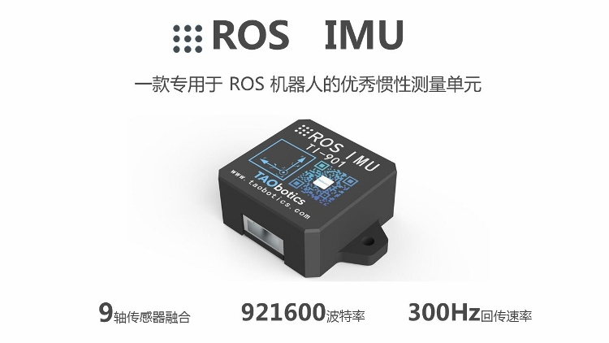    

## 介绍

handsfree_ros_imu 是用于学习使用 IMU 的 ROS 功能包，适用于 handsfree 推出的 3 款 ROS IMU。同时也含有纯 python 编写的输出数据显示, 支持 Linux、Windows 相关的脚本文件。

[HandsFree ROS IMU 购买链接](https://item.taobao.com/item.htm?id=634027133148&ali_trackid=2:mm_26632258_3504122_32538762:1607955215_176_1820526432&union_lens=lensId:OPT@1607955206@212a8363_06ed_1766199523e_c878@01;recoveryid:201_11.27.58.136_21013517_1607955156105;prepvid:201_11.87.178.209_21008506_1607955206099&clk1=3e91f5613ddee8ba055d43c0368cfc9b&spm=a2e0b.20350158.31919782.18&pvid=100_11.182.77.179_11449_6761607955206647512&scm=null&bxsign=tbkozY1fyN0hsF81R/xTfHbTs5netRJ2MylEoFSlUg/Ds4QInP5TK8iioSmX2JM66JbK2KXA4JwODRwz0JptZUNTK3pfqvfvE6ObkDSU+tV8o4=)

## HandsFree ROS IMU用户手册

handsfree_ros_imu　支持 ROS、Linux、Windows 开发环境，相关开发请查看用户手册：
[HandsFree ROS IMU用户手册](./tutorials/doc.md)

## 展示
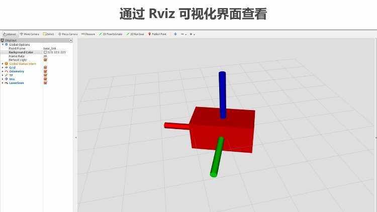    
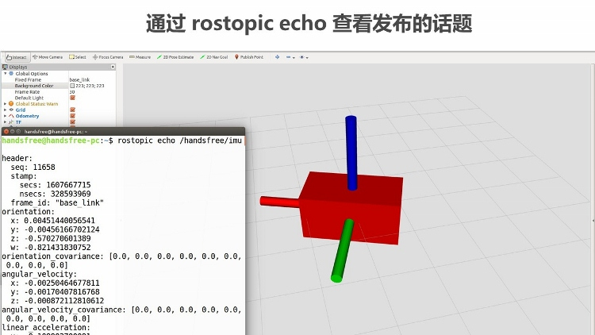    
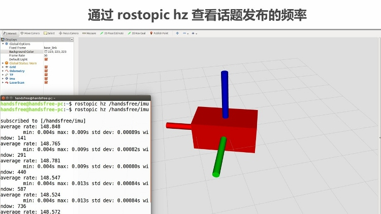    
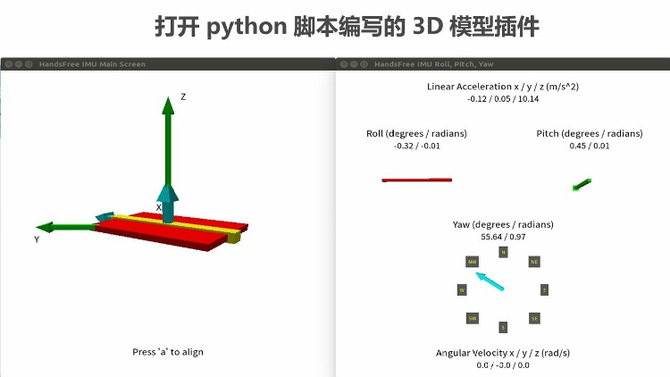    
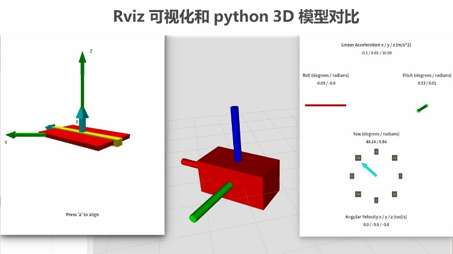    
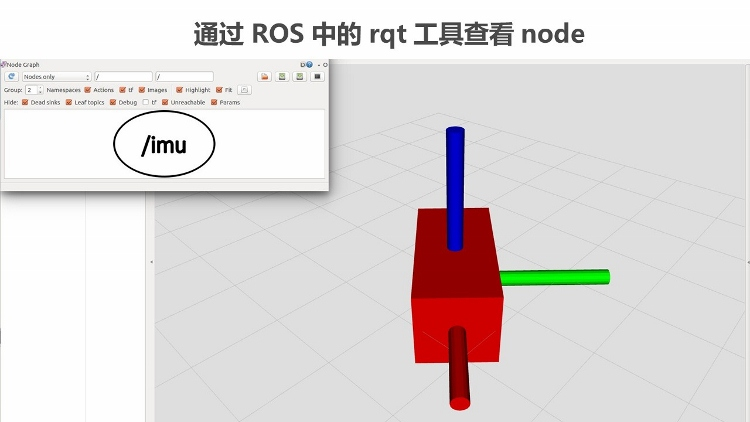    
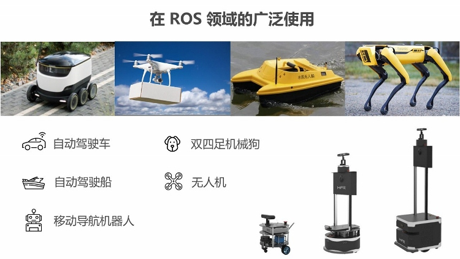    
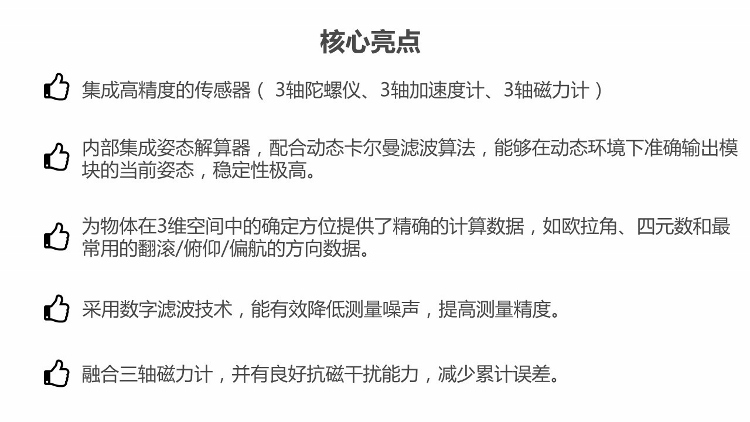    
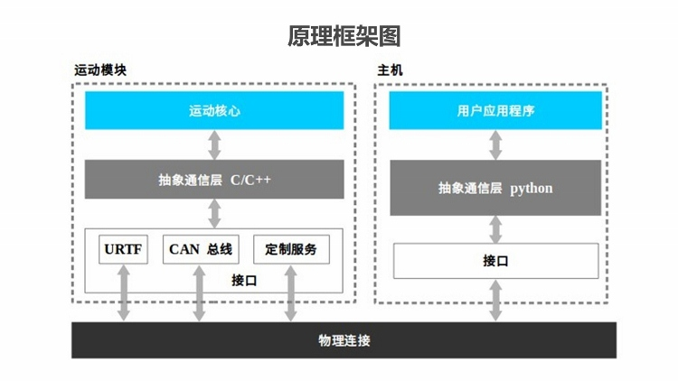    
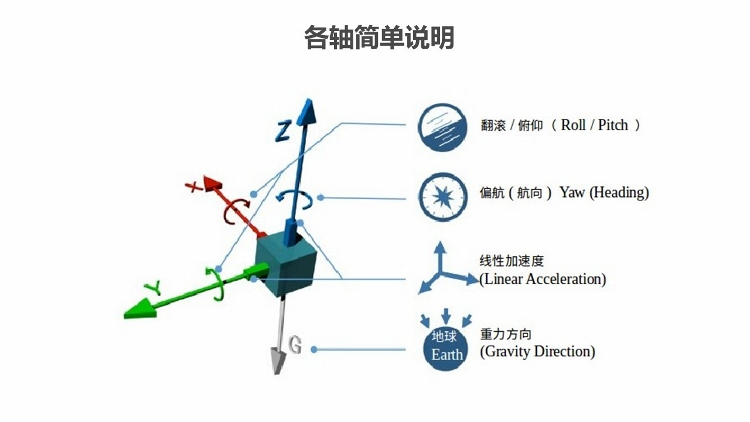    
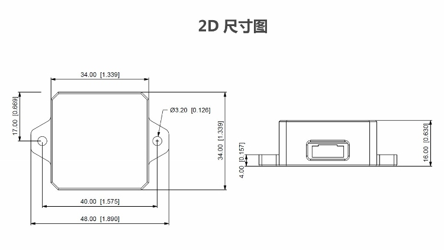    
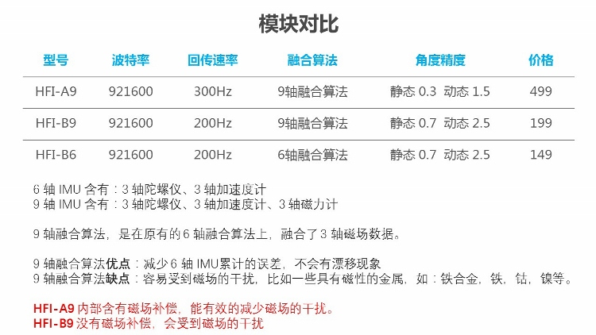    
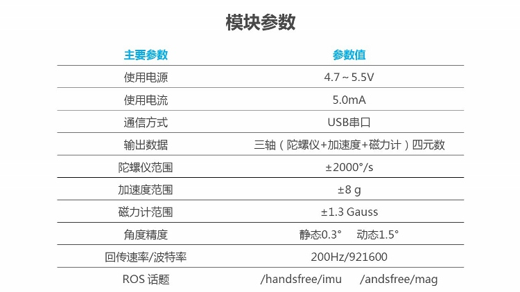    
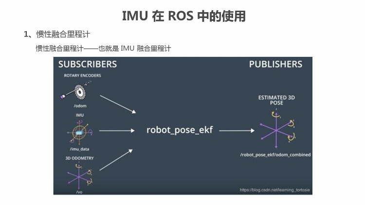    
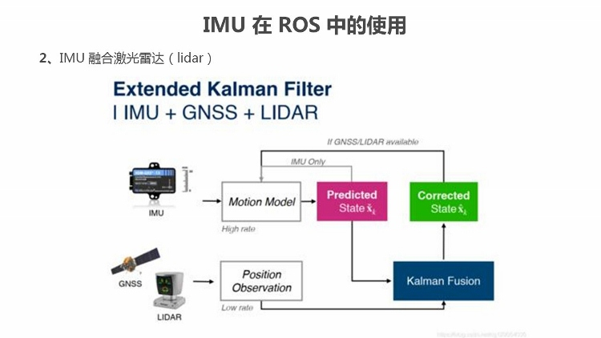    
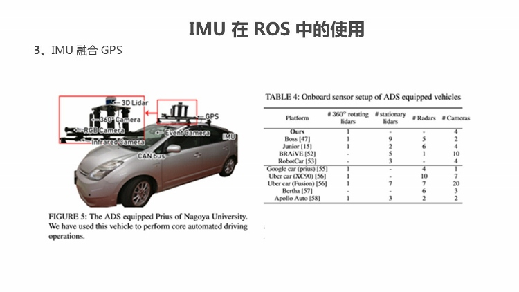    
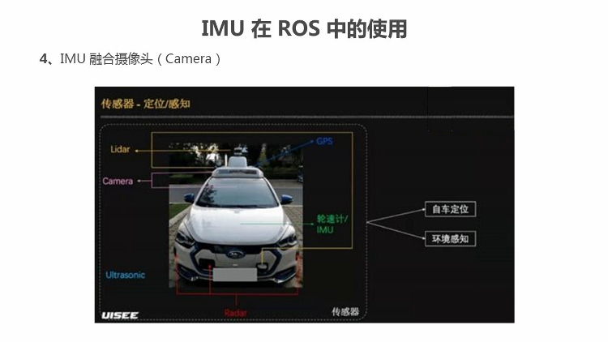    

