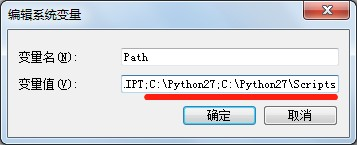
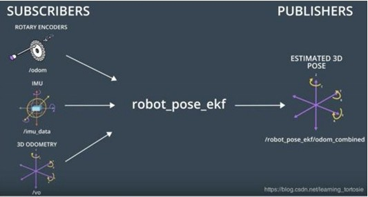
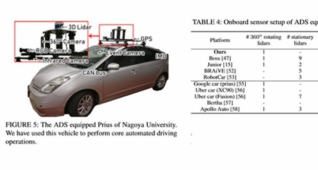

# HandsFree ROS IMU 用户手册

## 在 ROS 环境下使用 IMU

ROS包支持的环境版本：
* ubuntu 16.04, ROS kinetic
* ubuntu 18.04, ROS Melodic
* ubuntu 20.04, ROS Noetic

如果使用其它ROS版本，请用户自己探索安装相关环境。

### 安装 ROS 依赖包

1. 安装 ros imu　功能依赖包

    如果你使用的是 ubuntu 16.04, ROS kinetic:

    ```
    sudo apt-get install ros-kinetic-imu-tools ros-kinetic-rviz-imu-plugin
    sudo apt-get install python-visual
    ```

    如果你使用的是 ubuntu 18.04, ROS Melodic:

    ```
    sudo apt-get install ros-melodic-imu-tools ros-melodic-rviz-imu-plugin
    ```

    如果你使用的是 ubuntu 20.04, ROS Noetic:

    ```
    sudo apt-get install ros-noetic-imu-tools ros-noetic-rviz-imu-plugin
    ```

2. 下载并编译 handsfree_ros_imu 驱动包，如果没有安装 git 工具，请使用 `sudo apt-get install -y git`命令，通过终端安装。

    ```
    mkdir -p  ~/handsfree/handsfree_ros_ws/src/
    cd ~/handsfree/handsfree_ros_ws/src/
    git clone https://gitee.com/HANDS-FREE/handsfree_ros_imu.git
    cd ~/handsfree/handsfree_ros_ws/
    catkin_make
    cd ~/handsfree/handsfree_ros_ws/src/handsfree_ros_imu/scripts/
    sudo chmod 777 *.py
    ```

3. 将 setup.sh 写入 .bashrc 文件中 

    ```
    echo "source ~/handsfree/handsfree_ros_ws/devel/setup.bash" >> ~/.bashrc
    source ~/.bashrc
    ```
        
4. 插上 USB 设备（连接 IMU 的 USB，检查电脑能否识别到 ttyUSB0，检测到 ttyUSB0 后，给 ttyUSB0 赋权限

    ```
    ls /dev/ttyUSB0
    sudo chmod 777 /dev/ttyUSB0
    ```

### 使用各功能包

陀螺仪和加速计的发布话题：/handsfree/imu

磁力计的发布话题：/handsfree/mag

1. 通过 USB 连接线将 IMU 和电脑连接。

2. 运行 ROS 驱动可视化程序，打开 rviz 。

    ```
    roslaunch handsfree_ros_imu rviz_and_imu.launch imu_type:=a9（改成你的imu的型号，可选项：a9，b9，b6）
    ```
    

3. 运行脚本获取 IMU 欧拉角格式数据：Roll（翻滚），Pitch（俯仰），Yaw（偏航）

    ```
    rosrun rosrun handsfree_ros_imu get_imu_rpy.py
    ```
    

4. 打开通过 python 脚本编写的 3D 可视化（此功能只适用于 ubuntu 16.04　ROS kinetic 环境）
    
    ```
    roslaunch handsfree_ros_imu display_and_imu.launch imu_type:=a9（改成你的imu的型号，可选项：a9，b9，b6）
    ```
    

    此时，转动手中的 IMU，就会看到 rviz 上面的模型的变化了。

## 在Linux环境下使用IMU （无需安装ROS）

以 ubuntu16.04 为例

1. 下载驱动软件包压缩包，[驱动包下载地址](https://gitee.com/HANDS-FREE/handsfree_ros_imu/repository/archive/dev.zip)，并解压到用户目录。

    

2. 插上 USB 设备（连接 IMU 的 USB）,检查电脑能否识别到 ttyUSB0，检测到 ttyUSB0　后，给 ttyUSB0 赋权限

    ```
    ls /dev/ttyUSB0
    sudo chmod 777 /dev/ttyUSB0
    ```

3. 进入 `/handsfree_ros_imu/demo/linux`下，通过终端运行对应模块的 python 文件

    ```
    python hfi_a9.py
    ```

## 在Windows环境下使用IMU

以 win7 为例

1. 安装 python2.7 并配置相关的环境 python 环境和 pip 环境

    前往官网下载 python2.7，并进行安装，下载地址：[python2.7下载地址](https://www.python.org/downloads/)

        

    以上图为例，是默认安装的 python 所在目录，Scripts 目录有 pip 工具

2. 通过 cmd 命令处理器检测 python 是否安装成功，同时通过 pip 下载 pyserial 串口模块

        

    以上图为例，通过输入 python 来检测 python2.7 是否安装成功。

    通过 pip install pyserial 来安装串口模块

3. 下载并安装 cp2102 串口驱动，下载地址: [cp2102驱动](https://handsfree-mv.oss-cn-shenzhen.aliyuncs.com/handsfree_robot/tools/windows%E4%B8%B2%E5%8F%A3%E9%A9%B1%E5%8A%A8/CP2102.zip)

4. 下载驱动软件包压缩包，[驱动包下载地址](https://gitee.com/HANDS-FREE/handsfree_ros_imu/repository/archive/dev.zip)，并解压到桌面。

        

5. 插上 USB 设备（连接 IMU 的 USB）,检查电脑能否识别到 COM口，可以在设备管理器中找到 cp2102 端口和 COM口）

        

6. 进入 `/handsfree_ros_imu/demo/windows`下，修改对应　python　驱动程序文件的　COM3　为你电脑上对应的　COM　口，然后双击对应的　python　程序文件来运行脚本或者用命令行运行。

## 其他
通过 python3 ，或 ROS Noetic 使用请将 master 分支切换到 noetic 分支，下载使用

    

## 主要文件介绍

### 关于 launch 文件夹中 .launch 文件描述

在 launch 文件夹有 5 个 launch 文件

1. display_and_imu.launch

    打开 3d 的图形化界面节点和 IMU节点

2. handsfree_imu.launch

    打开 IMU 节点，默认打开型号为 a9 的IMU模块。

3. rviz_and_imu.launch

    打开 rviz 可视化界面和 IMU 节点

4. view_display.launch

    单独打开 3d 图形化界面，使用前需要先打开 IMU 节点。

5. view_rviz.launch

    单独打开 rviz 可视化界面，使用前需要先打开 IMU 节点。

### 关于 scripts 文件夹中 .py 文件描述

1. display_3D_visualization.py 

    通过 python 编写的 3d 的图形化界面节点

2. get_imu_rpy.py

    获取欧拉角 IMU 的偏航、俯仰翻滚角

3. hfi_a9_ros.py

    IMU 型号为 a9 的驱动节点

4. hfi_b9_ros.py

    IMU 型号为 b9 的驱动节点

5. hfi_b6_ros.py

    IMU 型号为 b6 的驱动节点

6. hfi_d6_ros.py

    IMU 型号为 d6 的驱动节点

### 关于 demo/windows和linux 文件夹中的 .py 文件描述

demo 文集中有 windows 和 linux 中的 python 文件不依赖于 ros

1. hfi_xx.py的文件

    用于在终端输出原始传感器数据

2. hfi_xx_ui.py

    通过 ui 界面输出传感器原始数据

## 关于 imu 的一些相关使用

### 1、里程计和 IMU 融合

通过机器人运动学解算可以把测量到的电机运动数据转换成里程计数据，电机里程计通过扩展卡尔曼滤波融合 IMU 偏航(yaw)角的数据后，可以把机器人里程计的精度大大提升，称之为惯性融合里程计。

里程计的权重信息可以通过打滑碰撞检测模块来确定,通过检测电机的电流和编码器测量的电机速度以及 IMU 数据，来判断是否发生打滑和碰撞。若发生这些情况则意味着里程计会发生瞬间漂移，通过降低里程计的权重可以大概率的保障定位导航系统的可靠性。



### 2、视觉 SLAM 和 IMU 融合

视觉 SLAM 容易受图像遮挡，光照变化,运动物体干扰弱纹理场景等影响，单目视觉无法测量尺度，深度信息往往无法直接获取，仅通过单张图像无法获得像素的深度信息，需要通过三角测量的方法来估计地图点的深度。此外单目纯旋转运动无法估计，快速运动时易丢失。

视觉与 IMU 融合之后会弥补各自的劣势，可利用视觉定位信息来估计 IMU 的零偏，减少IMU由零偏导致的发散和累积误差。IMU 可以为视觉提供快速运动时的定位，IMU 可以提供尺度信息，避免单目无法测尺度 


### 3、GPS 和 IMU 融合

目前的 GPS 有很多时候是精度不够准确或者无效的，例如在隧道中经常因为信号不好无法使用，或者在市中心的高楼里 GPS 信号容易被折射反射。这个时候 IMU 就可以增强 GPS 的导航能力。例如，在车道线识别模块失效时，利用失效之前感知到的道路信息和 IMU 对汽车航迹的推演，仍然能够让汽车继续在车道内行驶。

此外，GPS 更新频率过低（仅有 10Hz）不足以提供足够实时的位置更新，IMU 的更新频率可以达到 100Hz 或者更高完全能弥补 GPS 所欠缺的实时性。GPS/IMU 组合系统通过高达 100Hz 频率的全球定位和惯性更新数据，可以帮助自动驾驶完成定位。通过整合 GPS 与 IMU，汽车可以实现既准确又足够实时的位置更新。

IMU 连同板载 ADAS 和卫星定位输入，提供精确的车辆位置和航向画面，同时抑制正常驾驶产生的冲击和振动。



### 4、其他

IMU 设计的应用领域广泛，在军航空航天、航海、军事、医疗、娱乐、机器人、车辆等领域都有这重要的作用。


